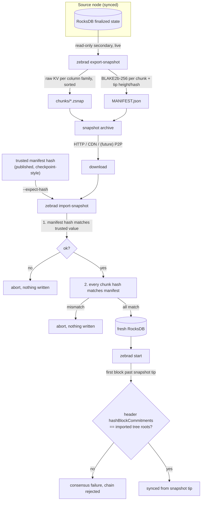

# Architecture

How a zsnap snapshot moves from a synced node to a fresh one, and the one design
decision that matters most: how the imported state is trusted.

## Data flow

## Components

- **export-snapshot** opens the state in RocksDB read-only secondary mode, so it runs
  against a live node without stopping it. It walks every column family in sorted key
  order and writes framed key-value bytes plus a manifest of per-chunk BLAKE2b-256 hashes.
- **The archive** is the chunk files plus `MANIFEST.json`. The published "snapshot hash" is
  the hash of the manifest bytes, which transitively covers every chunk.
- **import-snapshot** authenticates the manifest against a trusted hash, verifies every
  chunk against the manifest, then bulk-loads into a fresh database. It refuses to write
  over an existing one.
- **tail-sync** is normal Zebra. The first block committed above the snapshot tip is where
  consensus re-checks the imported shielded trees.

## ADR-001: Trust model for snapshot verification

**Status:** accepted (prototype)

**Context.** An imported snapshot must not let a node accept invalid monetary state
(double spends, inflation). The transparent UTXO set and the nullifier sets are not
committed to in block headers, so they cannot be verified trustlessly from headers alone.
A naive "download a database directory" approach (what the community does today via shared
Docker volumes) has no verification at all.

**Options considered.**

1. **Bespoke bootstrap validator.** Ship a separate, lightweight validation pass that
   re-checks consensus-critical invariants during import.
   - Rejected. It is a second validation codebase to audit, test, and keep in step with
     protocol upgrades, used only at bootstrap. This was the main objection that sank the
     prior proposal (#187).
2. **Full replay from the snapshot.** Import state, then re-verify by replaying blocks.
   - Rejected. It defeats the purpose; replay is exactly the cost we are removing.
3. **Checkpoint-analogous trusted hash, plus consensus re-check of shielded state.**
   Trust the snapshot the same way Zebra already trusts its hardcoded block checkpoints,
   and lean on existing consensus for the shielded parts.
   - Chosen.

**Decision.** Two layers, no new validator:

- **Trusted manifest hash.** The published manifest hash is embedded/compared the same way
  Zebra embeds checkpoint block hashes. Same trust model, no new assumption. Anyone with a
  synced node can regenerate the snapshot and confirm the hash, because export is
  deterministic (canonical sorted-key serialization, not raw database files).
- **Trustless shielded re-check.** The imported note commitment trees and history tree are
  verified against the tip block header's `hashBlockCommitments` as soon as the first block
  past the snapshot tip is committed, through Zebra's normal validation path. Forged
  shielded state cannot survive tail-sync.

**Trade-offs accepted.**

- The transparent UTXO and nullifier sets rest on the trusted-hash layer, not on a header
  commitment. Making those trustless needs a consensus change (state commitments in
  headers) and is out of scope. This is the same position Bitcoin's assumeutxo takes.
- Snapshots are pinned to a database format major version and must be regenerated on format
  bumps. The manifest records the version and the importer refuses a mismatch.

**Consequences.** No separate validator to maintain (answers the #187 review). Determinism
is testable and testable cheaply (see `crate::snapshot::tests`). The design reuses code and
trust that Zebra and its reviewers already accept.

**Where the trusted hash comes from.** The manifest hash is embedded in the binary per
network and height, in `zebra-state/src/snapshot/*-snapshot-hashes.txt`, exactly like
Zebra's hardcoded block checkpoints. An import without `--expect-hash` authenticates against
that embedded value, so operators trust the reviewed, signed release rather than any single
publisher. A review-gated CI workflow regenerates the list, and a value is only added after
independent reproducible-hash attestations agree (see `attestations/`). Two further bindings
close format drift: the manifest records the database format version and network (import
refuses a mismatch), and import refuses any snapshot whose column-family set differs from the
build's, so there is no parallel serializer that can silently diverge from the format.
